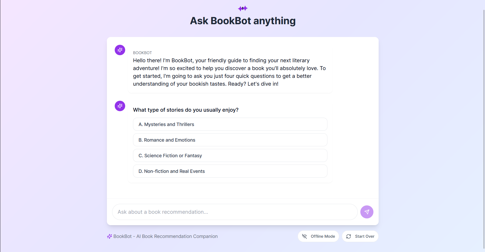
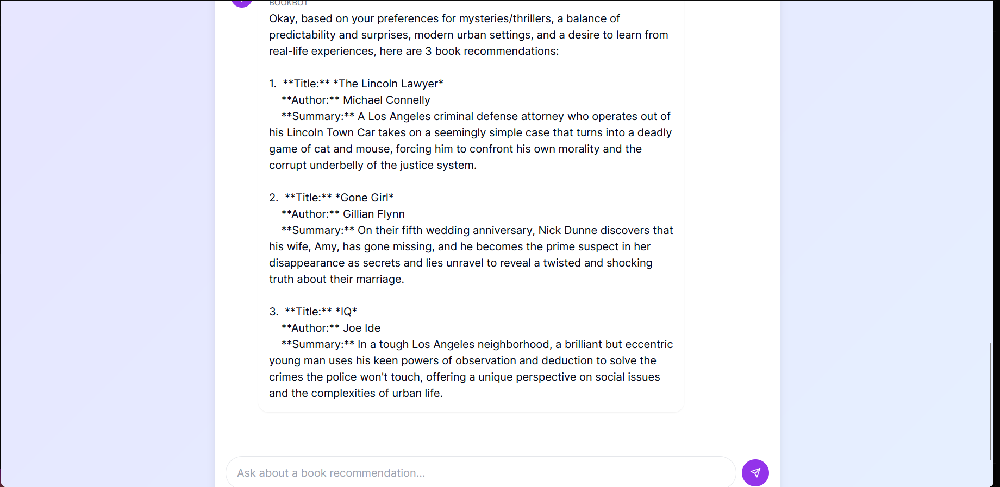

# BookBot - AI Book Recommendation Assistant

## 📚 Overview

BookBot is a personalized book recommendation system that uses AI to suggest books based on user preferences through a 4-question interaction.

## 📸 Screenshots


*Main chat interface where users answer questions*


*Personalized book recommendations view*

## 🎯 Core Features

* Interactive questionnaire
* AI-powered book recommendations
* User-friendly chat interface
* Mobile responsive design

## 🛠️ Technical Stack

* **Frontend:** Next.js, TypeScript
* **Styling:** Tailwind CSS
* **UI Components:** shadcn/ui
* **State Management:** React Hooks

## 💻 Installation

```bash
git clone https://github.com/Mostafa-Emad77/bookbot.git
cd bookbot
pnpm install
```

## ⚙️ Configuration

Create a `.env.local` file:

```env
OPENAI_API_KEY=your_api_key_here
```

## 🚀 Development

```bash
pnpm dev
```

Visit `http://localhost:3000`

## 📁 Project Structure

```
bookbot/
├── app/
│   ├── chat/
│   └── api/
├── components/
│   ├── chat/
│   └── ui/
├── lib/
└── public/
```

## 🤖 Question Flow

1. Genre Preferences
2. Recent Reading History
3. Time Availability
4. Mood/Theme Preferences

## 📱 Mobile Support

* Fully responsive design
* Custom mobile hooks
* Touch-friendly interface
* Adaptive layout

## 🔒 Security

* API Key Authentication
* Protected Routes
* Secure Environment Variables

## 📄 License

MIT License

## 🤝 Contributing

1. Fork the repo
2. Create feature branch
3. Commit changes
4. Push to branch
5. Open PR

## 📫 Support

* GitHub Issues
* Documentation Wiki
* Email Support
